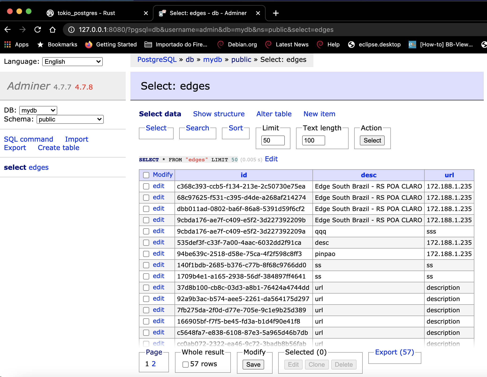

<h1> RustRestAPI </h1>

RUST REST API with database with sql-client asyncrono and pipeline (tokio-postgres).

***
<h2> Create Database using Docker Container </h2>

<h3> Setting up database: </h3>

> docker-compose build

> docker-compose up

<h3> Migrations (create db): </h3>
    Create database tables, index etc

> cargo run --bin migrations

Use adminer for database administer using web brownser:

Select database postgres, database mydb

> http://127.0.0.1:8080/

* The database, password and user have been set from the docker compose file.

Login adminer for administrator:

Database created after running Migrations:

***
<h3>  Running webservice </h3>

Start server for development:
> cargo run --bin service

Tests webservice:
> curl -s http://localhost:8000/edges

> curl -s -X PUT "http://localhost:8000/edge/172.188.1.235/desc"

> curl -s http://localhost:8000/edge/e03d0c3c-70b0-9ad3-37e9-50815fbc7ddf | jq .

> curl -s -X DELETE "http://localhost:8000/edge/e03d0c3c-70b0-9ad3-37e9-50815fbc7ddf"

<h3> Project references: </h3>

https://github.com/diegopacheco/rust-playground/tree/master/rust-microservice